# BOTS v2 Investigation Report

## 1. Investigation Information

- **Investigation:** BOTS v2 / Splunk 2
- **Analyst:** ______________________________
- **Date:** ______________________________
- **Splunk environment:** ______________________________
- **Dataset:** `botsv2`
- **Evidence scope:** 100, 200, 300, and 400 Series
- **Evidence images currently catalogued:** 42

## 2. Controlled Environment and Data Privacy

All activities represented in this report are limited to a **simulated, isolated, and controlled training environment** using the BOTS v2 training dataset and designated laboratory tools.

This report does not document or imply monitoring, scanning, exploitation, investigation, containment, eradication, recovery, or other security activity against a live organizational production environment. Values appearing in the BOTS v2 dataset are treated as simulated/training data.

No production data, confidential company information, real organizational credentials, private keys, or other restricted information should be added to this report.

## 3. Purpose and Evidence Method

This report contains the **complete 28-question BOTS v2 / Splunk 2 investigation sequence**, organized into the 100, 200, 300, and 400 Series. Each question includes a paraphrased question statement, the relevant SPL used in the referenced investigation, the resulting answer/finding, and the uploaded screenshot evidence associated with the investigation step.

The questions and explanatory material are paraphrased from the supplied learning reference. SPL commands are retained as shown in that reference where they were part of the investigation workflow. The report therefore serves as a structured training record rather than a reproduction of the source article.

> **Evidence provenance:** Reference material is used for study and cross-checking. Uploaded screenshots should be treated as candidate evidence only when they were captured from the candidate's own authorized laboratory session. Reference screenshots must not be represented as independently performed evidence.

---

# 4. 100 Series — Amber Turing Investigation

## 100-Q1 — What competitor website domain did Amber visit while looking for executive contact information?

### Investigation

First identify Amber's simulated internal IP from PAN traffic, then pivot to HTTP traffic and filter for beer-related sites.

### SPL

```spl
index="botsv2" sourcetype="pan:traffic" amber
```

```spl
index="botsv2" sourcetype="stream:http" "10.0.2.101"
```

```spl
index="botsv2" sourcetype="stream:http" "10.0.2.101" *beer*
| dedup site
| table site
```

### Answer / Finding

**www.berkbeer.com**. The simulated PAN event identifies Amber's address as `10.0.2.101`, and the HTTP pivot identifies the competitor domain.

### Evidence

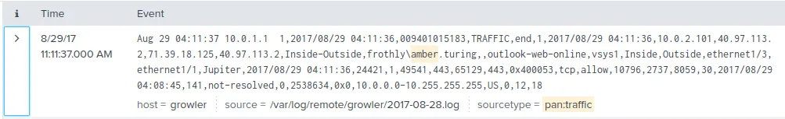

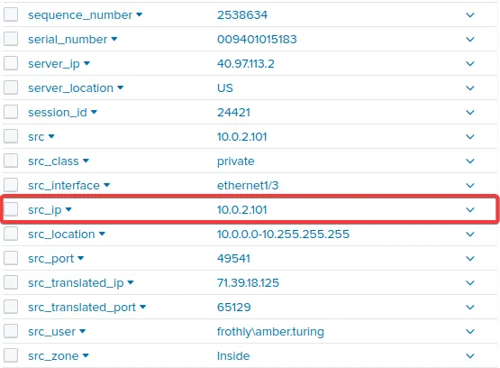

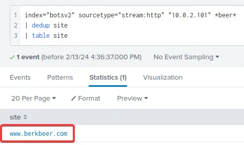

---

## 100-Q2 — Which image file on the competitor website displayed the executive's contact information?

### SPL

```spl
index="botsv2" sourcetype="stream:http" "10.0.2.101" "www.berkbeer.com"
```

### Answer / Finding

**`/images/ceoberk.png`**.

### Evidence

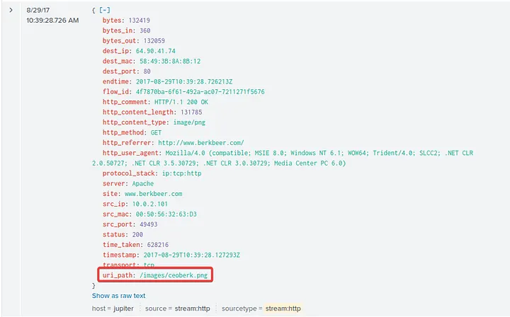

---

## 100-Q3 — What is the CEO's first and last name?

### SPL

```spl
index="botsv2" sourcetype="stream:smtp" "berkbeer.com"
```

### Answer / Finding

**Martin Berk**. The SMTP event and its raw message provide the simulated CEO identity.

### Evidence

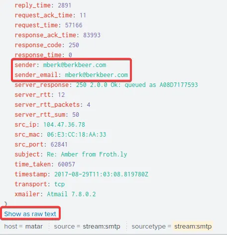

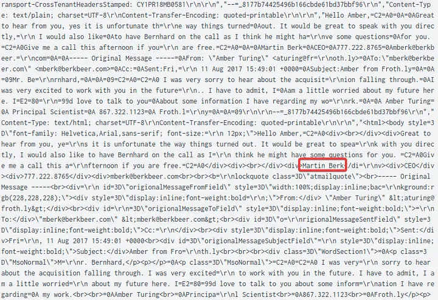

---

## 100-Q4 — What email address belongs to the CEO?

### SPL

```spl
index="botsv2" sourcetype="stream:smtp" "berkbeer.com"
```

### Answer / Finding

**mberk@berkbeer.com**.

### Evidence

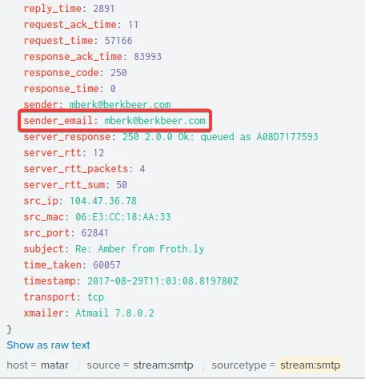

---

## 100-Q5 — After contacting the CEO, what email address belongs to the other competitor employee Amber contacted?

### SPL

```spl
index="botsv2" sourcetype="stream:smtp" "berkbeer.com"
```

### Answer / Finding

**hbernhard@berkbeer.com**.

### Evidence

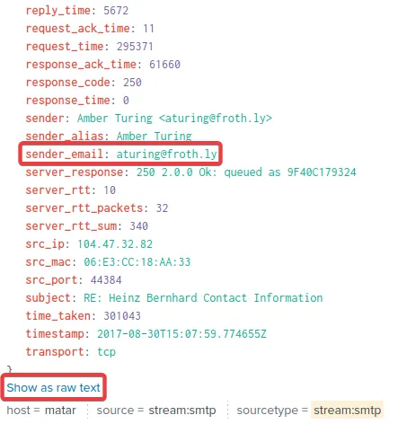

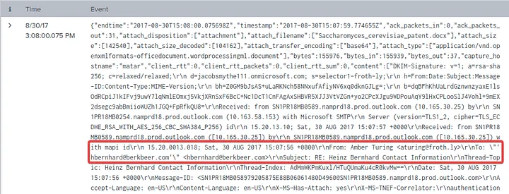

---

## 100-Q6 — What was the filename of the attachment Amber sent to the competitor contact?

### Investigation

The same SMTP event from Q5 is examined through its `attach_filename` field.

### Answer / Finding

**`Saccharomyces_cerevisiae_patent.docx`**.

### Evidence

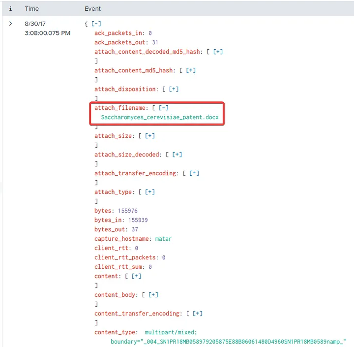

---

## 100-Q7 — What personal email address is associated with Amber?

### Investigation

The same email event contains Base64-encoded content. Decoding that content reveals the simulated personal email address.

### Answer / Finding

**ambersthebest@yeastiebeastie.com**.

### Evidence

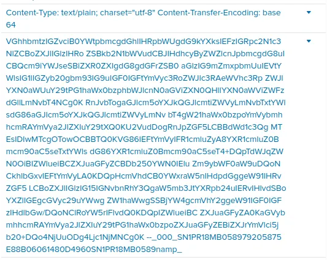

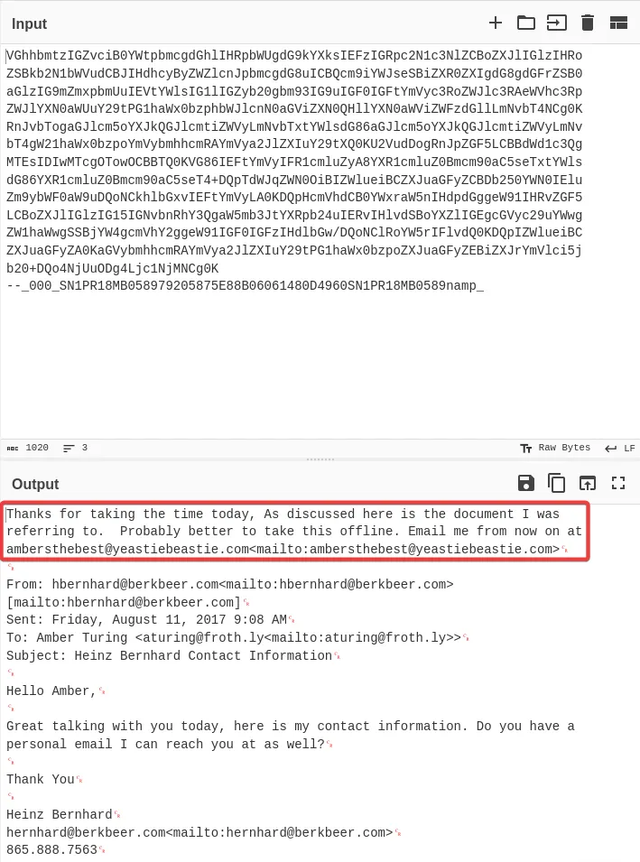

---

# 5. 200 Series — Web, Vulnerability Scanning and XSS Investigation

## 200-Q1 — What version of the TOR Browser did Amber install to obscure her web browsing?

### SPL

```spl
index="botsv2" "tor" "amber" "install"
| sort -_time desc
```

### Answer / Finding

**7.0.4**.

### Evidence

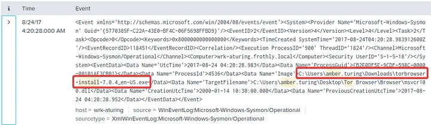

---

## 200-Q2 — What public IPv4 address belongs to the server running www.brewertalk.com?

### SPL — DNS

```spl
index="botsv2" source="stream:dns" "www.brewertalk.com"
| table host_addr{}
| dedup host_addr{}
```

### SPL — HTTP destination

```spl
index="botsv2" source="stream:http" "www.brewertalk.com"
| table dest_ip
| dedup dest_ip
```

### Answer / Finding

**52.42.208.228** is the simulated public IPv4 address. The HTTP search also exposes the private address **172.31.4.249**, which is used in later correlation.

### Evidence

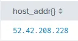

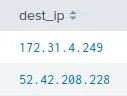

---

## 200-Q3 — What IP address was used by the system performing the web vulnerability scan against www.brewertalk.com?

### SPL

```spl
index="botsv2" source="stream:http" "www.brewertalk.com"
| stats count by src_ip
```

### Answer / Finding

**45.77.65.211**. The simulated source generates substantially more HTTP requests than the other sources.

### Evidence

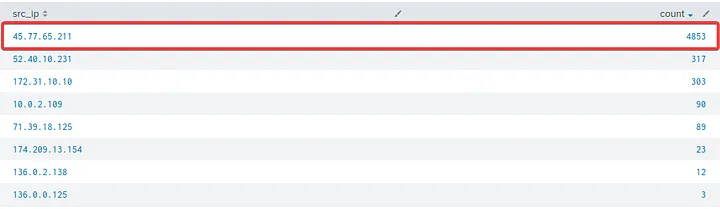

---

## 200-Q4 — Which URI path was most frequently targeted by the same attacking IP?

### SPL

```spl
index="botsv2" src_ip="45.77.65.211" dest_ip="172.31.4.249"
| stats count by uri_path
```

### Answer / Finding

**`/member.php`**.

### Evidence

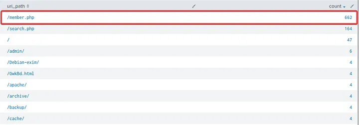

---

## 200-Q5 — Which SQL function was abused on the targeted URI path?

### SPL

```spl
index="botsv2" src_ip="45.77.65.211" dest_ip="172.31.4.249" uri_path="/member.php" select
```

### Answer / Finding

**`updatexml`**, indicating SQL-injection behavior in the simulated web attack.

### Evidence

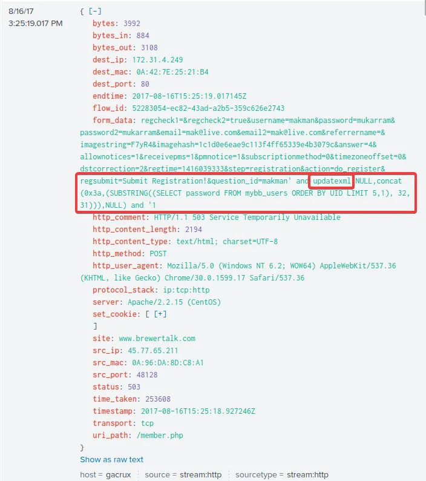

---

## 200-Q6 — What numeric cookie value did Kevin's browser send to the malicious URL during the XSS attack?

### SPL

```spl
index="botsv2" sourcetype="stream:http" kevin "<script>"
```

### Answer / Finding

**1502408189**.

### Evidence

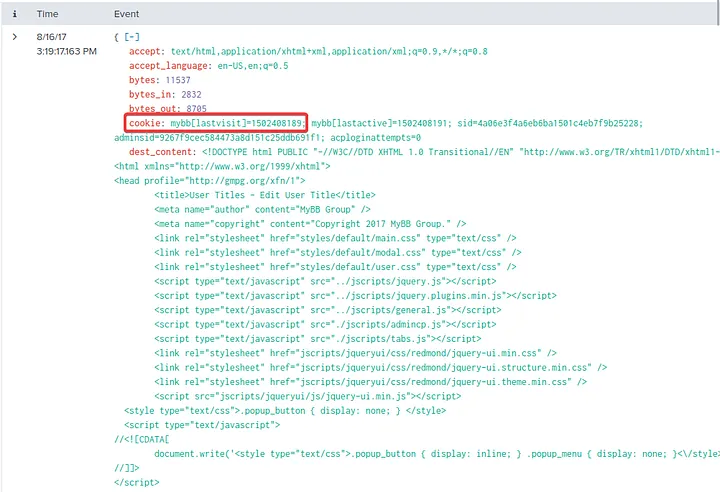

---

## 200-Q7 — What username was maliciously created on brewertalk.com through the simulated spearphishing/XSS activity?

### Investigation

The same event used for Q6 contains account-creation information in the destination content.

### Answer / Finding

**kIagerfield**.

### Evidence

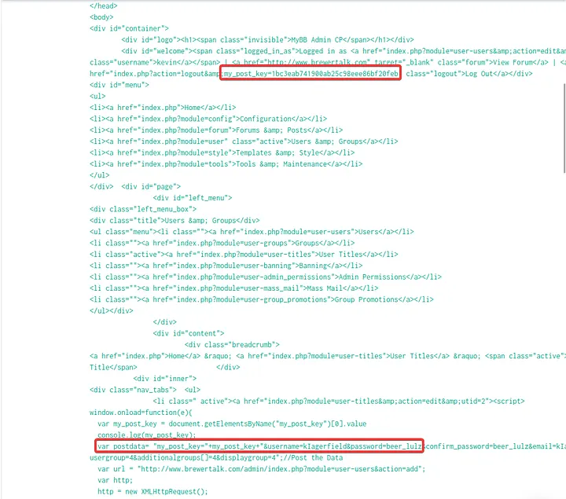

---

# 6. 300 Series — Ransomware, USB and Malware Investigation

## 300-Q1 — What was the filename of Mallory's critical PowerPoint after ransomware encrypted it?

### SPL — identify Mallory's host

```spl
index="botsv2" mallory
```

### SPL — locate PowerPoint file events

```spl
index="botsv2" mallory host="MACLORY-AIR13" *.ppt*
```

### Answer / Finding

**Frothly_marketing_campaign_Q317.pptx.crypt_**.

### Evidence

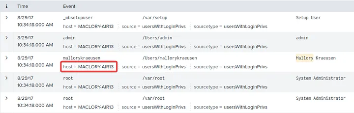

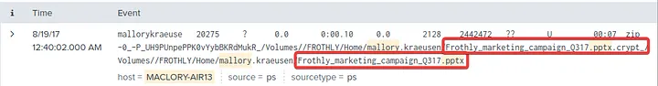

---

## 300-Q2 — Which Game of Thrones season and episode corresponds to the encrypted movie file?

### SPL

```spl
index="botsv2" host="maclory-air13" (got OR game OR thrones) *crypt*
```

### Answer / Finding

**S07E02** — Season 7, Episode 2.

### Evidence

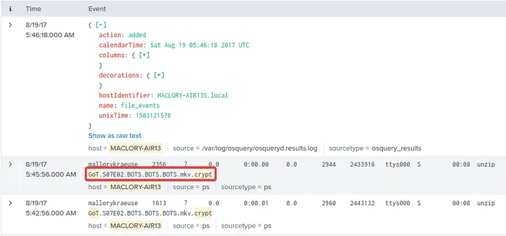

---

## 300-Q3 — What vendor manufactured the USB drive likely used to transfer malware to Mallory's MacBook?

### SPL

```spl
index="botsv2" kutekitten usb
```

### Investigation

The event is narrowed using the USB hardware-monitoring record. Its model, serial and vendor identifiers are then used for external vendor identification.

### Answer / Finding

**Alcor Micro Corp.**

### Evidence

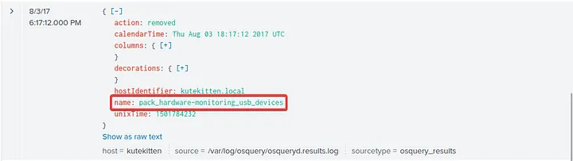

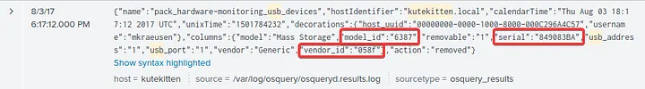

> **Evidence gap:** The reference walkthrough also contains a separate vendor-ID lookup image. That separate lookup screenshot is not among the 42 uploaded portfolio images currently catalogued. The vendor lookup should therefore be treated as reference/supporting evidence unless an additional authorized screenshot is added.

---

## 300-Q4 — What programming language is used in at least part of the malware?

### SPL — correlate the user and host events

```spl
index="botsv2" kutekitten mkraeusen
```

### SPL — narrow to file events

```spl
index="botsv2" kutekitten mkraeusen name=file_events
```

### Investigation

The file event reveals the suspicious malware artifact and its MD5. The hash is then checked using VirusTotal.

### Answer / Finding

**PERL**.

### Evidence

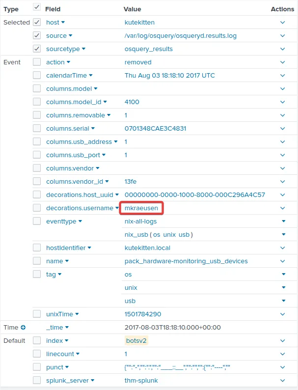

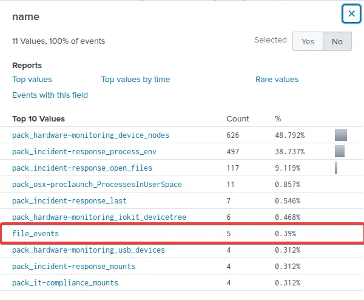

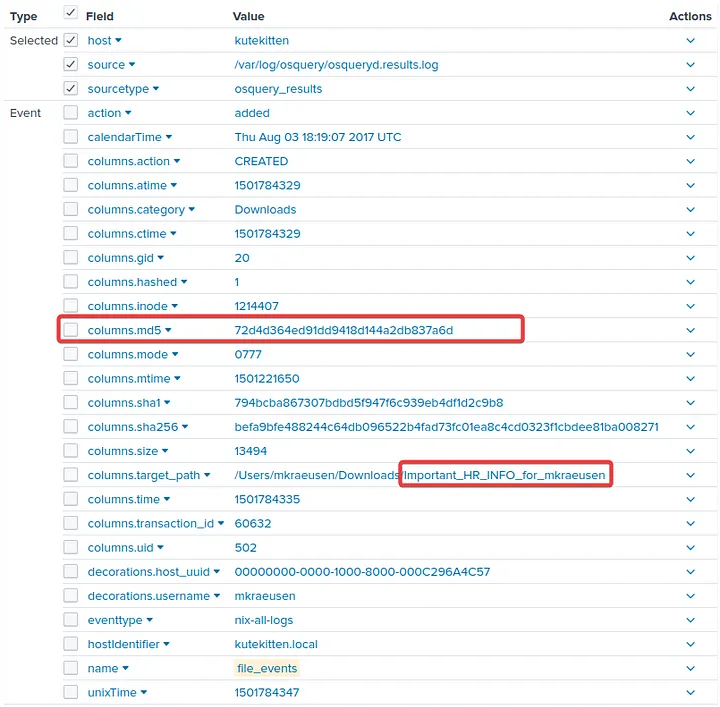

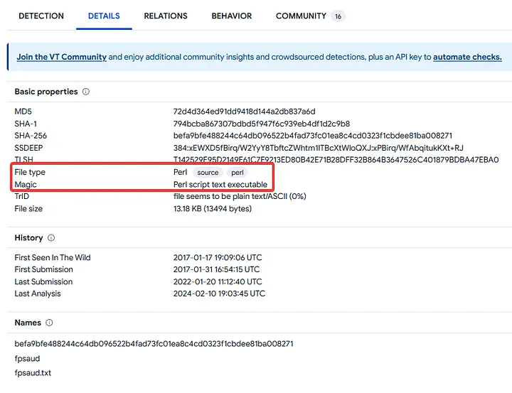

> **Filename note:** The original uploaded filenames are preserved even where their embedded question number does not perfectly match the final evidence classification.

---

## 300-Q5 — When was the malware first observed in the wild?

### Investigation

The malware hash is examined in VirusTotal's Details information.

### Answer / Finding

**2017-01-17**.

### Evidence

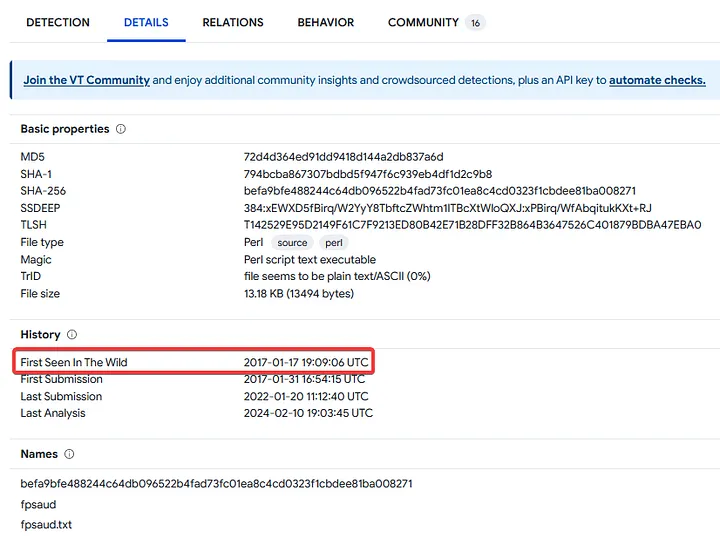

---

## 300-Q6 — What is the alphabetically first FQDN used by the malware to communicate with a C2 server?

### Investigation

The VirusTotal Relations information is used to identify the simulated dynamic-DNS destinations associated with the malware.

### Answer / Finding

**eidk.duckdns.org**.

### Evidence


---

## 300-Q7 — What is the alphabetically second FQDN used by the malware to communicate with a C2 server?

### Answer / Finding

**eidk.hopto.org**.

### Evidence

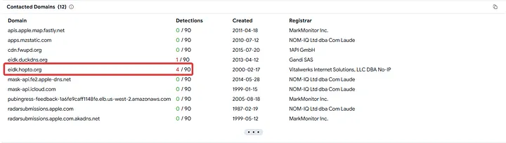

> **Filename note:** The uploaded filenames for images 31 and 32 contain `q05`; the labels above are based on their investigation content. The original filenames remain unchanged.

---

# 7. 400 Series — Taedonggang APT, Malware and Persistence

## 400-Q1 — What ZIP attachment did a malicious Taedonggang actor send to Frothly as part of the simulated spearphishing activity?

### SPL

```spl
index="botsv2" sourcetype="stream:smtp" .zip
```

### Answer / Finding

**invoice.zip**.

### Evidence

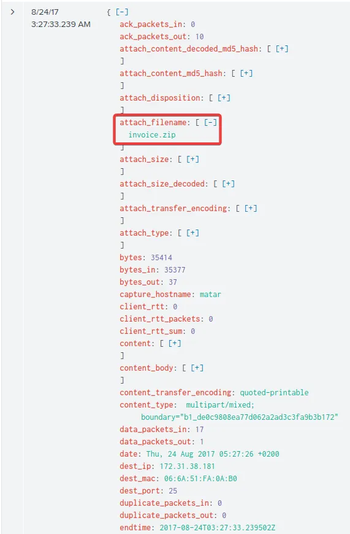

---

## 400-Q2 — What password was provided to open the ZIP attachment?

### Investigation

The raw content of the same simulated SMTP event is inspected for the plaintext password.

### Answer / Finding

**912345678**.

### Evidence

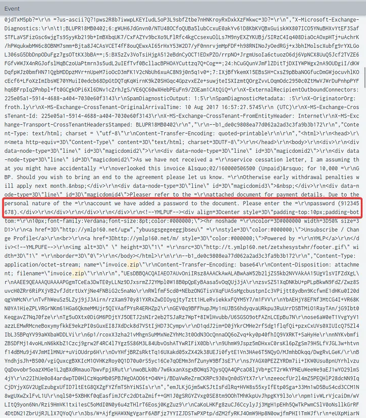

---

## 400-Q3 — What SSL Issuer value was used for the majority of the simulated Taedonggang traffic?

### SPL

```spl
index="botsv2" dest_ip="45.77.65.211" SSL
```

### Answer / Finding

**C = US**.

### Evidence

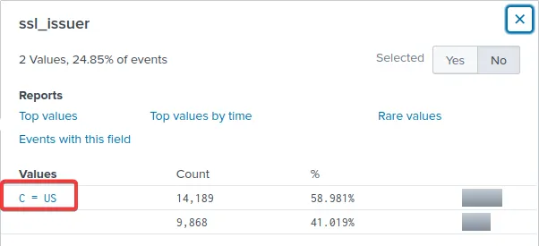

---

## 400-Q4 — What unusual file was downloaded into the simulated Frothly environment by winsys32.dll?

### SPL — locate winsys32.dll activity

```spl
index="botsv2" winsys32.dll
```

### SPL — narrow to FTP retrieval activity

```spl
index="botsv2" sourcetype="stream:ftp" ("get" OR "retr")
```

### Answer / Finding

**나는_데이비드를_사랑한다.hwp**.

### Evidence

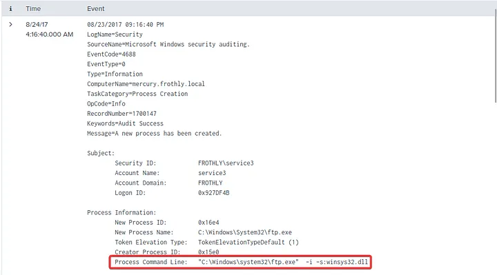

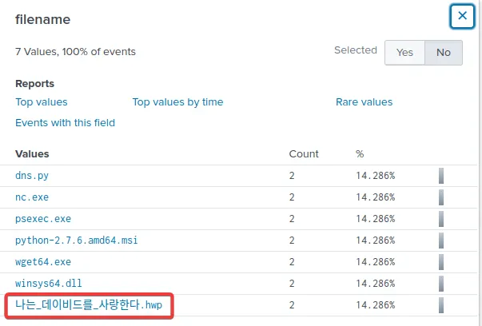

---

## 400-Q5 — What first and last name appears in the metadata of the file associated with PowerShell Empire execution on the first simulated victim workstation?

### Investigation

The referenced malware-analysis result is used to inspect the file metadata.

### Answer / Finding

**Ryan Kovar**.

### Evidence

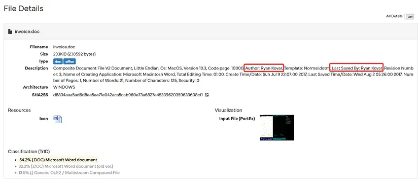

> **External-analysis note:** This evidence comes from malware-analysis information associated with the training scenario. It should be treated as supporting evidence and not as evidence of activity against a real production system.

---

## 400-Q6 — What type of points is mentioned in the document when the relevant text is found?

### Investigation

The document is examined in the referenced sandbox-analysis workflow.

### Answer / Finding

**CyberEastEgg**.

### Evidence

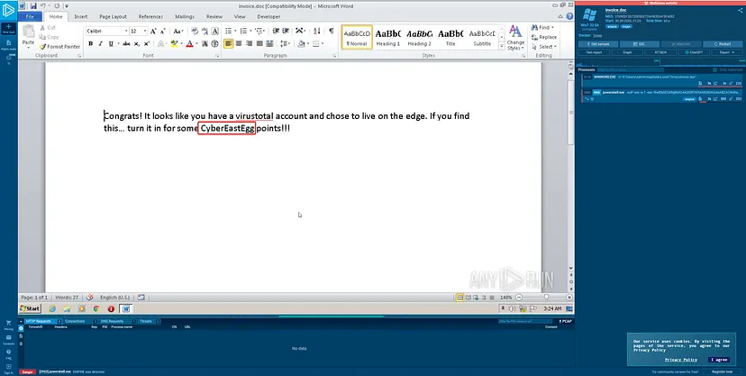

---

## 400-Q7 — What single webpage is most frequently contacted by the scheduled tasks used for simulated C2 persistence?

### SPL — identify newly created scheduled tasks

```spl
index="botsv2" schtasks.exe sourcetype=wineventlog create
```

### SPL — locate the registry data used by the simulated persistence mechanism

```spl
index="botsv2" HKLM\\Software\\Microsoft\\Network
```

### Investigation

The scheduled-task events are correlated with the registry data. The relevant `data` field is Base64 encoded and is decoded using UTF-16 Little Endian to expose the simulated C2 URL.

### Answer / Finding

**process.php**. The decoded value resolves to a simulated connection such as `https://45.77.65.211:443/login/process.php`.

### Evidence

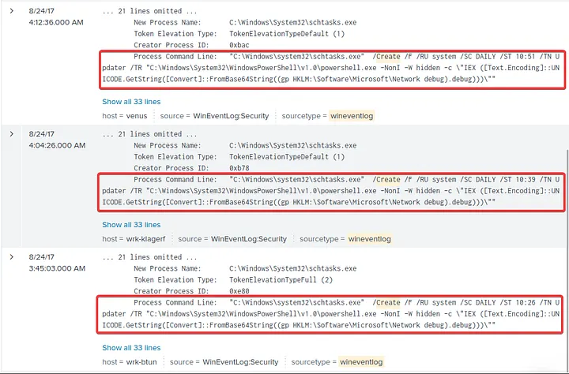

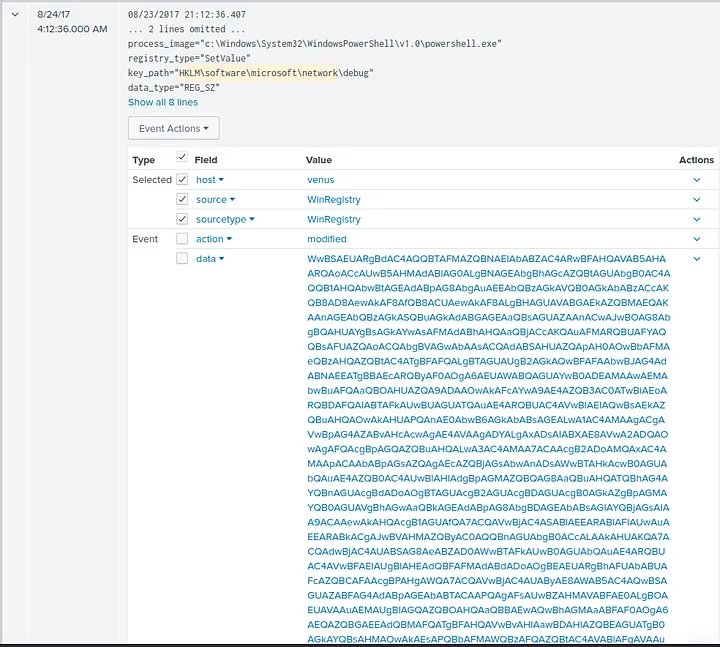

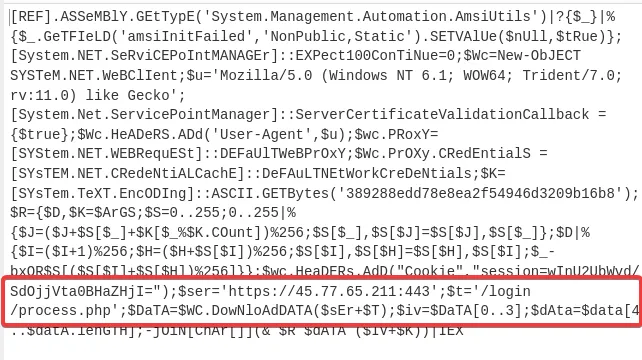

---

# 8. Consolidated Answer Summary

| Series | Question | Answer / Finding |
|---|---:|---|
| 100 | Q1 | `www.berkbeer.com` |
| 100 | Q2 | `/images/ceoberk.png` |
| 100 | Q3 | Martin Berk |
| 100 | Q4 | `mberk@berkbeer.com` |
| 100 | Q5 | `hbernhard@berkbeer.com` |
| 100 | Q6 | `Saccharomyces_cerevisiae_patent.docx` |
| 100 | Q7 | `ambersthebest@yeastiebeastie.com` |
| 200 | Q1 | `7.0.4` |
| 200 | Q2 | `52.42.208.228` |
| 200 | Q3 | `45.77.65.211` |
| 200 | Q4 | `/member.php` |
| 200 | Q5 | `updatexml` |
| 200 | Q6 | `1502408189` |
| 200 | Q7 | `kIagerfield` |
| 300 | Q1 | `Frothly_marketing_campaign_Q317.pptx.crypt_` |
| 300 | Q2 | `S07E02` |
| 300 | Q3 | Alcor Micro Corp. |
| 300 | Q4 | PERL |
| 300 | Q5 | 2017-01-17 |
| 300 | Q6 | `eidk.duckdns.org` |
| 300 | Q7 | `eidk.hopto.org` |
| 400 | Q1 | `invoice.zip` |
| 400 | Q2 | `912345678` |
| 400 | Q3 | `C = US` |
| 400 | Q4 | `나는_데이비드를_사랑한다.hwp` |
| 400 | Q5 | Ryan Kovar |
| 400 | Q6 | CyberEastEgg |
| 400 | Q7 | `process.php` |

---

# 9. Evidence and TESDA Relevance

The investigation provides strong simulated evidence for log/event analysis, network-traffic analysis, endpoint analysis, malware/IOC analysis, threat intelligence, incident investigation and reporting. The 200 Series provides supporting evidence for vulnerability-related analysis, but it is not by itself a complete TESDA vulnerability-scanning workflow. The investigation also does not demonstrate full containment, eradication, recovery, or vulnerability-management lifecycle activities.

Those remaining requirements are intentionally reserved for separate **simulated, isolated, controlled supplementary laboratory activities** rather than live-production work.

## Evidence domains represented

- `01-monitoring-and-alerts`
- `02-log-event-analysis`
- `03-network-traffic-analysis`
- `04-endpoint-analysis`
- `05-malware-ioc-analysis`
- `06-vulnerability-scanning` — supporting evidence only
- `07-incident-investigation`
- `08-threat-intelligence`
- `11-reporting`

## Important limitation

BOTS v2 is an investigation/threat-hunting evidence source. It should not be used to claim that the candidate performed real-world production monitoring, vulnerability scanning, containment, eradication, recovery, or vulnerability management.

---

# 10. Reference and Evidence Integrity

The supplied Splunk 2 walkthrough was used to verify the question sequence, investigation approach and SPL commands. The questions in this report are paraphrased rather than reproduced verbatim. The SPL commands are retained where they form part of the documented investigation workflow.

The uploaded screenshots are linked using their actual repository filenames. Reference-derived images must be clearly identified as reference/supporting material if they were not captured by the candidate during an authorized laboratory session.

**Portfolio rule:** only actual, authorized laboratory results may be represented as candidate-generated evidence.
